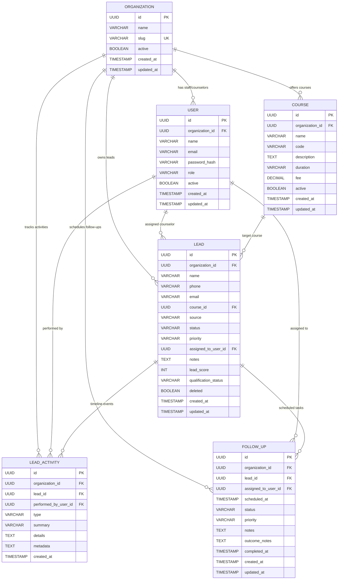

# Phase 3 Domain Model & Data Architecture

## 1. Domain Overview

The **Phase 3 Lead Management Engine** provides the operational core for Indian coaching and training institutes (e.g. IIT-JEE, NEET, UPSC, Banking, Software training institutes). It manages student inquiries, course mappings, counselor assignments, sales pipeline progression, timeline auditing, and task follow-ups.

This structured domain foundation is explicitly designed to support future AI qualification and conversion scoring (Phases 5 & 6) without storing critical business context only in unstructured blobs.

---

## 2. Entity-Relationship Diagram

---

## 3. Entity Specifications & Architectural Rationale

### A. Lead (`leads`)
- **Primary Identifier**: `UUID` (Server-generated random UUIDv4).
- **Tenant Scoping**: `organization_id` (Mandatory, non-updatable).
- **Contact Details**:
  - `name`: Student or parent contact name.
  - `phone`: Standardized 10-digit Indian phone string (e.g. `9876543210`), indexed for O(1) duplicate checks.
  - `email`: Normalized lowercase email string (optional).
- **Pipeline & Classification**:
  - `course_id`: Foreign key to `courses(id)` (nullable if lead is undecided).
  - `source`: Enum (`WEBSITE`, `WHATSAPP`, `INSTAGRAM`, `FACEBOOK`, `GOOGLE_ADS`, `REFERRAL`, `WALK_IN`, `OTHER`).
  - `status`: Enum (`NEW`, `CONTACTED`, `QUALIFIED`, `FOLLOW_UP`, `CONVERTED`, `LOST`).
  - `priority`: Enum (`LOW`, `MEDIUM`, `HIGH`, `URGENT`).
  - `assigned_to_user_id`: Foreign key to `users(id)` (nullable if unassigned).
  - `lead_score`: Integer (0–100), default 0 (AI-ready score attribute).
  - `qualification_status`: Enum (`UNQUALIFIED`, `QUALIFIED`, `DISQUALIFIED`).
  - `deleted`: Soft-deletion boolean flag.

### B. Course (`courses`)
- Represents institute educational offerings (e.g. "NEET 1-Year Repeaters", "JEE Advanced 2-Year", "Fullstack Java Bootcamp").
- **Constraints**:
  - `(organization_id, name)` unique constraint ensures no duplicate course names within the same coaching institute.
  - `fee`: Stored as `NUMERIC(12, 2)` (INR currency).
  - `active`: Boolean flag allowing archiving without breaking historical lead references.

### C. Lead Activity (`lead_activities`)
- **Append-Only Immutable Event Stream**: Every state transition, counselor call, student note, assignment handoff, and follow-up completion writes a permanent record.
- **Fields**:
  - `type`: Activity category (`CREATED`, `STATUS_CHANGED`, `ASSIGNED`, `NOTE_ADDED`, `CALL_LOGGED`, `MESSAGE_LOGGED`, `EMAIL_LOGGED`, `FOLLOW_UP_SCHEDULED`, `FOLLOW_UP_COMPLETED`, `FOLLOW_UP_CANCELLED`, `COURSE_CHANGED`, `CONVERTED`, `LOST`).
  - `summary`: Human-readable 1-line log text.
  - `details`: Rich text notes from counselors or student conversation summaries.
  - `metadata`: JSON string capturing structured state changes (e.g. `{"fromStatus":"NEW","toStatus":"CONTACTED"}`).

### D. Follow-Up (`follow_ups`)
- **Operational Task Lifecycle**: First-class scheduling entity for institute counselors.
- **Status State Machine**:
  - `PENDING`: Scheduled for future date/time.
  - `COMPLETED`: Counselor executed call/meeting and logged `outcome_notes`.
  - `CANCELLED`: Student cancelled or rescheduled.
  - `OVERDUE`: Evaluated dynamically when `scheduled_at < NOW()` and status is `PENDING`.
- **Timezone**: Stored in UTC `Instant` and converted to `Asia/Kolkata` (IST, UTC+5:30) for display.

---

## 4. Key Architectural Decisions

1. **Lead Assignment Storage**:
   - Represented directly as `assigned_to_user_id` on `leads` for high query performance.
   - Assignment history is preserved via immutable `ASSIGNED` events in `lead_activities`.
2. **Follow-Up vs Lead Activity**:
   - `follow_ups` is a distinct entity to allow instant querying of counselor task queues, daily agendas, and overdue reminders.
   - Every follow-up creation and completion emits an audit event into `lead_activities`.
3. **Duplicate Ingestion Strategy**:
   - Duplicate inquiries on `(organization_id, normalized_phone)` do not spawn conflicting duplicate lead records.
   - Inquiries are appended to the existing lead's timeline as an activity event, and closed leads (`LOST`) are automatically reopened.
4. **AI-Readiness**:
   - Fields `lead_score`, `qualification_status`, structured activity metadata, and normalized source types ensure Phase 5/6 AI models can consume deterministic training/context data.
