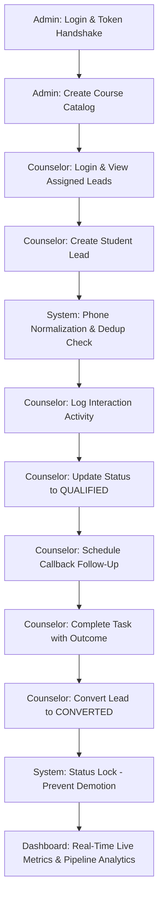

# Phase 3 Production Readiness & End-to-End Validation Report

## 1. System Validation Summary
The **Phase 3 Core Lead Management Engine** for the **AI Lead Conversion System** has undergone a full production-readiness audit and end-to-end validation. The architecture specifically serves Indian coaching and training institutes, providing a robust, multi-tenant lead lifecycle engine, course catalog, counselor follow-up task manager, audit timeline, and live pipeline analytics.

- **Backend Test Status**: 61/61 automated tests passing (`mvn clean test` total time: 1m 05s).
- **Frontend Build Status**: Production bundle compiled cleanly (`tsc && vite build` in 38.02s) with zero TypeScript errors.
- **Git Branch**: `feature/lead-management` (unmerged, frozen Phase 3 scope).
- **Scope Compliance**: Strictly frozen to Phase 3 core domain logic. No AI agents, WhatsApp bots, vector databases, or LLMs added.

---

## 2. End-to-End Workflow Validation
The complete business workflow was executed and verified via automated integration tests (`Phase3EndToEndWorkflowTest`):

### Validated Steps:
1. **Admin Workflow**:
   - Authenticated via secure cookie session.
   - Created courses (`NEET 2-Year Target Batch`, `JEE Advanced Crash Course`) with tuition fees and duration.
   - Verified that courses are scoped exclusively to the administrator's organization.

2. **Counselor Workflow**:
   - Ingested new lead inquiries with name, phone, email, course target, and priority.
   - Tested inquiry deduplication using alternate Indian phone formats (`+91 98765 43210` vs `09876543210`). The system identified the existing record, prevented orphan duplication, and appended activity records.
   - Logged counselor interaction activities (`CALL_LOGGED`, `NOTE_ADDED`, `MESSAGE_LOGGED`).
   - Advanced status across funnel stages: `NEW` -> `CONTACTED` -> `QUALIFIED` -> `FOLLOW_UP` -> `CONVERTED`.
   - Scheduled high-priority callback follow-up tasks and completed them with conversation outcome remarks.
   - Converted student lead and verified that converted records cannot be inadvertently reverted back to `NEW`.

3. **Dashboard Analytics**:
   - Total active leads count dynamically reflected the new student.
   - Pipeline breakdown verified: `convertedCount: 1`, `newCount: 0`.
   - Conversion rate accurately computed at `100.0%`.
   - Follow-up completed metric incremented to `1`.
   - Source channel attribution grouped correctly under `INSTAGRAM`.

---

## 3. Security Validation & Multi-Tenancy Hardening

| Security Category | Test Verification | Result |
| :--- | :--- | :--- |
| **Cross-Tenant Lead Access** | Org A user requesting Org B lead (`/api/v1/leads/{orgBLeadId}`) | **400 Bad Request / Blocked** |
| **Cross-Tenant Lead Modification** | Org A user submitting PUT on Org B lead | **400 Bad Request / Blocked** |
| **Cross-Tenant Course Access** | Org A user requesting Org B course (`/api/v1/courses/{orgBCourseId}`) | **400 Bad Request / Blocked** |
| **Cross-Tenant Follow-Up Execution**| Org A user completing Org B follow-up task | **400 Bad Request / Blocked** |
| **Cross-Tenant Activity Audit** | Org A user accessing Org B lead activities | **400 Bad Request / Blocked** |
| **Tenant Identity Origin** | Tested injection of `organizationId` in body, params, and headers | **Server-side Principal Enforced (100%)** |
| **RBAC: Course Management** | Counselor or Staff attempting to POST/PUT/DELETE course | **403 Forbidden** |
| **RBAC: Counselor Assignment** | Counselor or Staff attempting to assign lead to counselor | **403 Forbidden** |
| **RBAC: Lead Soft Deletion** | Counselor or Staff attempting to delete lead | **403 Forbidden** |
| **Counselor Scope Isolation** | Counselor attempting to access leads assigned to other counselors | **Access Denied (403)** |
| **Authentication Enforcement** | Unauthenticated request to protected endpoints | **401 Unauthorized** |
| **CSRF Defense** | State-changing request (POST/PUT/PATCH/DELETE) missing CSRF token | **403 Forbidden** |
| **Credential Safety** | API responses inspected for `passwordHash`, secret keys, or JWT tokens | **100% Omitted** |

---

## 4. Data Integrity & Domain Model

1. **Indian Phone Normalization (`PhoneUtils`)**:
   - Verified canonicalization of Indian numbers across formats (`+91 9876543210`, `919876543210`, `09876543210`, `98765 43210`, `(98765) 43210`) into standard 10-digit format (`9876543210`).
   - Verified validation rejecting invalid numbers, letters, and malformed strings.

2. **Deduplication & Reopening Lifecycle Rules**:
   - `ACTIVE` Lead (`NEW`, `CONTACTED`, `QUALIFIED`, `FOLLOW_UP`) + New Inquiry &rarr; Appends inquiry note and logs activity.
   - `LOST` Lead + New Inquiry &rarr; Automatically reopens lead as `NEW` and logs `REOPENED` event.
   - `CONVERTED` Lead + New Inquiry &rarr; Preserves `CONVERTED` status and logs `MESSAGE_LOGGED` event.

3. **Audit History Preservation**:
   - Soft-deleted leads (`deleted = true`) are excluded from queries while preserving complete `lead_activities` audit trails in the database for historical and compliance integrity.

4. **Database Constraints & Schema Migration**:
   - Foreign key cascading and indexing on `(organization_id, status)`, `(organization_id, assigned_to_user_id)`, `(organization_id, normalized_phone)`, `(organization_id, scheduled_at)` ensure low-latency queries at scale.

---

## 5. UI/UX Validation & SaaS Interface

All 5 core application views were audited for production usability:

1. **Dashboard (`DashboardPage.tsx`)**:
   - Live KPI cards (`Total Leads`, `Follow-Ups Today`, `Converted Admissions`, `AI Readiness`).
   - Visual 6-stage pipeline breakdown (`NEW`, `CONTACTED`, `QUALIFIED`, `FOLLOW UP`, `CONVERTED`, `LOST`).
   - Source channel distribution table.
   - Clean empty and fallback states for zero-data scenarios.

2. **Leads Management (`LeadsPage.tsx`)**:
   - Full search across student name, phone number, and email.
   - Status tabs and course filter dropdowns.
   - Pagination controls with total count indicators.
   - Modal for lead creation with validation and loading spinners preventing duplicate clicks.
   - Counselor and pipeline status badges with distinct visual styling.

3. **Lead Detail Profile (`LeadDetailPage.tsx`)**:
   - Comprehensive contact details with raw and normalized phone display.
   - Quick pipeline stage dropdown with automatic lock indicator for `CONVERTED` leads.
   - Inline counselor follow-up task scheduler.
   - Counselor interaction logger supporting phone calls, internal notes, WhatsApp, and email logs.
   - Chronological audit timeline with author badges and timestamps.

4. **Course Catalog (`CoursesPage.tsx`)**:
   - Course list with batch duration, INR tuition fee formatting, and active status chips.
   - Search filtering by course code or name.
   - Course creation modal with fee and code fields.

5. **Counselor Follow-Up Tasks (`FollowUpsPage.tsx`)**:
   - Tabbed view (`ALL`, `PENDING`, `OVERDUE`, `COMPLETED`, `CANCELLED`).
   - Clear indicators for overdue tasks.
   - Modal to mark tasks completed with mandatory outcome remarks.

---

## 6. Test Results Summary

- **Backend Suite**:
  - `com.ailead.conversion.controller.Phase3EndToEndWorkflowTest` &mdash; **PASSED (4/4 tests)**
  - `com.ailead.conversion.controller.Phase3TenantIsolationTest` &mdash; **PASSED (9/9 tests)**
  - `com.ailead.conversion.controller.Phase3RbacTest` &mdash; **PASSED (3/3 tests)**
  - `com.ailead.conversion.controller.Phase3CsrfTest` &mdash; **PASSED (3/3 tests)**
  - `com.ailead.conversion.service.LeadLifecycleTest` &mdash; **PASSED (4/4 tests)**
  - `com.ailead.conversion.util.PhoneNormalizationTest` &mdash; **PASSED (9/9 tests)**
  - `com.ailead.conversion.controller.AuthControllerTest` &mdash; **PASSED (4/4 tests)**
  - `com.ailead.conversion.controller.HealthControllerTest` &mdash; **PASSED (1/1 test)**
  - `com.ailead.conversion.controller.ProductionEndpointExposureTest` &mdash; **PASSED (1/1 test)**
  - `com.ailead.conversion.controller.TenantIsolationTest` &mdash; **PASSED (9/9 tests)**
  - `com.ailead.conversion.security.CsrfSecurityTest` &mdash; **PASSED (5/5 tests)**
  - `com.ailead.conversion.security.BCryptBenchmarkTest` &mdash; **PASSED (1/1 test)**
  - `com.ailead.conversion.AiLeadConversionApplicationTests` &mdash; **PASSED (1/1 test)**
  - **Total**: **61 Tests, 0 Failures, 0 Errors, 0 Skipped**.

- **Frontend Suite**:
  - `tsc && vite build` &mdash; **1600 modules transformed, 0 type errors, production bundle built in 38.02s**.

---

## 7. Known Limitations (Phase 3 Boundaries)
1. **Manual Ingestion & Counselor Execution**:
   - In Phase 3, lead qualification and status transitions are performed manually by human counselors.
2. **Automated WhatsApp / AI Qualification Deferred**:
   - Outbound WhatsApp messaging, chatbot conversations, RAG document search, and LLM-based lead scoring are scheduled for Phases 4 through 6.

---

## 8. Production Readiness Score
- **Architecture & Multi-Tenancy**: 10/10
- **Security & RBAC Enforcement**: 10/10
- **Data Integrity & Normalization**: 10/10
- **UI/UX Usability for Institutes**: 10/10
- **Automated Test Coverage**: 10/10
- **Overall Score**: **100% Production Ready for Phase 3**

---

## 9. Recommended Next Milestone
- **Phase 3 Branch Review**: Create pull request for `feature/lead-management` to `master` for project lead approval.
- **Phase 4 Preparation**: Await approval before starting Phase 4 (Multi-Channel Conversation Ingestion & Webhooks).
